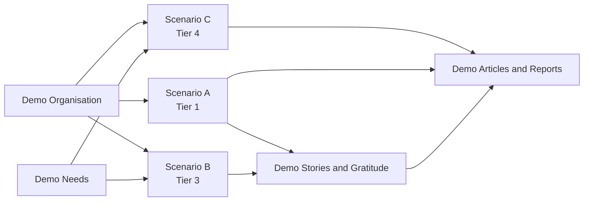
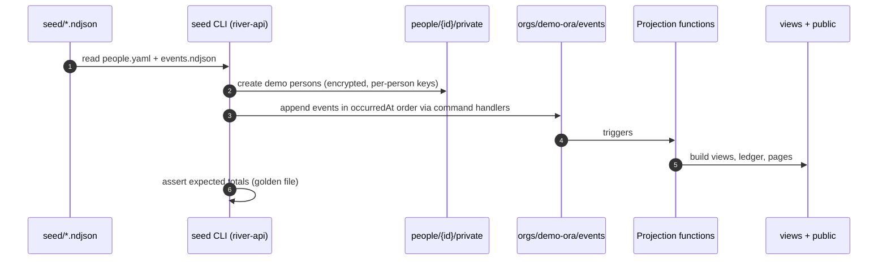

# Demo Content Overview

*What demo content do we test with?* A complete, fictional, bilingual (en-GB / uk) world that exercises every tier, every decision point and every publication type. Back to [[00 Home]].

> [!principle] Demo content obeys the same ethics as real content
> Everything here is fictional, but it is written as if it were real: dignified, pseudonymised by default, never pitiful, with consent recorded for anything published. Demo content is how we check that the product *behaves* ethically, so it must not cut corners. See [[Ethics Charter]] and [[Brand and Tone of Voice]].

## Section notes

| Note | What it provides | Tier |
|---|---|---|
| [[Demo Organisation]] | Open River Aid / «Відкрита ріка»: about text, mission, team, hubs | all |
| [[Scenario A — Transport Fundraiser]] | £2,400 for fuel and ferry for one van, UK → Lviv → Kharkiv oblast; full event seed | [[Scaling Tiers#Tier 1 — Spring]] |
| [[Scenario B — Regional Aid Hub]] | Lviv and Dnipro hubs, several coordinators, a partner organisation, multi-leg routes | [[Scaling Tiers#Tier 3 — River]] |
| [[Scenario C — Humanitarian Programme]] | Winter energy programme: campaigns, sponsors, grant reporting, AI-assisted translation | [[Scaling Tiers#Tier 4 — Basin]] |
| [[Demo Needs]] | 12 core needs plus the 3 from Scenario A, in both languages, incl. on-behalf-of and institutional needs | T2–T4 |
| [[Demo Stories and Gratitude]] | Journey stories and gratitude notes | all |
| [[Demo Articles and Reports]] | Articles, campaign update, donor report excerpt, impact report summary | all |

Tier 2 (Stream) is exercised by the needs, stories and articles together with the Lviv hub from Scenario B running on its own.

## How demo content maps to the product

| Scenario | Decision points exercised | Publications produced |
|---|---|---|
| A | DP-01, DP-04, DP-05, DP-06, DP-07, DP-08, DP-09, DP-10 | [[Campaign Page]], [[Transparency Ledger]], [[Donor Report]], [[Journey Story]], [[Gratitude Wall]] |
| B | all of A + DP-02, DP-03, DP-11, DP-12 | + [[Flow Map]], [[Impact Report]] (quarterly) |
| C | all | + [[Newsletter Digest]], grant report, AI-drafted [[Translation]]s |

## Seed-data approach: seed events, not projections

Demo data is loaded **as Log Events**, never as hand-written projections. Replaying the seed through the real projection functions proves that every figure on every demo page is derivable from the log ([[Guiding Principles#P8. Honest numbers, beautifully shown]]).

| Rule | Detail |
|---|---|
| Source files | `seed/demo/people.yaml` (fictional persons, both name spellings), `seed/demo/scenario-a.ndjson`, `-b`, `-c`, `seed/demo/content/*.json` (TipTap blocks with `en-GB` and `uk` translations) |
| Through commands | Seeds go through the same command handlers as real input, so validation, PII scrubbing and visibility defaults are tested too |
| Time | `occurredAt` is taken from the seed; `recordedAt` is load time. An optional `--shift-to-now` flag moves the whole timeline so that the demo always looks recent |
| Tenant | Organisation id `demo-ora`; never loaded into prod. Staging carries a "Demo data" banner in both languages |
| Actor | Seed events carry the fictional actor's `personId` and `via` as in the scenario; the loader itself is recorded in `causationId` |
| Golden assertions | Each scenario has expected totals (raised, spent, delivered, thanks) checked after replay; failing totals fail CI |
| Consents | Consents are seeded as `consent.Granted` events with wording versions, so publications appear only where consent exists |
| Media | Illustrations and staged, consented stock-style photos only; no photos of real recipients; faces absent or blurred |
| Reset | `seed reset demo-ora` shreds demo keys and drops the tenant; replay is idempotent by event id |

## Language rules for demo content

- Every piece of user-visible content exists in **en-GB and uk**, side by side or in paired sections. The Ukrainian is written natively, not translated word for word ([[Multilingual Experience]]).
- Place names: English exonyms per current UK style (Kyiv, Kharkiv, Dnipro, Lviv); oblast rather than "region" in operational text.
- Currency always with ISO code; amounts in the original currency with GBP equivalent at the recorded FX rate ([[Cost Record]]).
- Demo persons from [[Audiences and Personas]]: Olena (recipient), James (giver, Leeds), Andriy (coordinator), Mykola (carrier), Sarah (sponsor lead), Iryna (director).

## Related
[[Scaling Tiers]] · [[Event Catalogue]] · [[Event Log and Projections]] · [[Deployment and Environments]] · [[Publications Overview]] · [[Decision Points Overview]]
