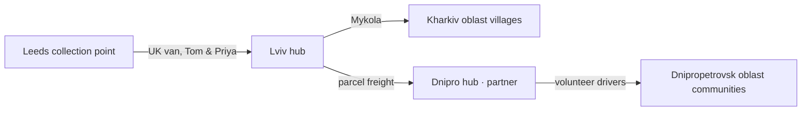

# Demo Organisation

**Open River Aid** (uk: **«Відкрита ріка»**) — a fictional small charity registered in England and Wales, working with Ukrainian volunteer coordinators. Tenant id `demo-ora`. Everything below is fictional and used only for demos and testing. Back to [[Demo Content Overview]].

## Identity

| Field | Value |
|---|---|
| Legal name | Open River Aid (fictional) |
| Charity number | 0000000 (demo — not a real registration) |
| Registered office | Leeds, United Kingdom |
| Operating hubs | Lviv (from Tier 2), Dnipro (from Tier 3) |
| Routes | UK → Netherlands / Belgium → Germany → Poland → Lviv → Kharkiv and Dnipropetrovsk oblasts |
| Locales | `en-GB` (default for UK), `uk` (default for Ukraine) |
| Data region | `europe-west2` |
| Brand | Primary colour river blue, accent sunflower; see [[Design Language]] |

## About text

| en-GB | uk |
|---|---|
| **We help help travel.** Open River Aid connects people in Ukraine who need something specific — a generator, warm bedding, a lift to hospital — with people in the UK and beyond who want to give. | **Ми допомагаємо допомозі дійти.** «Відкрита ріка» поєднує людей в Україні, яким потрібне щось конкретне — генератор, теплі ковдри, поїздка до лікарні, — з людьми у Великій Британії та інших країнах, які хочуть допомогти. |
| We started in 2022 as four friends with one van. Today we are a small team of coordinators, drivers and volunteers in Leeds, Lviv and Dnipro. | Ми почали у 2022 році вчотирьох, з одним бусом. Сьогодні ми — невелика команда координаторів, водіїв і волонтерів у Лідсі, Львові та Дніпрі. |
| Anyone can ask us for help. We never ask people to prove that they deserve it. We ask what is needed, where, and in what form — and then we find the way. | Звернутися по допомогу може кожен. Ми ніколи не просимо доводити, що людина на неї «заслуговує». Ми питаємо, що саме потрібно, куди і в якому вигляді, — а далі шукаємо шлях. |
| Every pound is visible. You can see what was raised, what the fuel and ferry cost, and when the help arrived. | Кожен фунт — на виду. Ви бачите, скільки зібрано, скільки коштували пальне й пором і коли допомога дійшла. |
| And when help arrives, the thanks travels back to everyone who made it possible. | А коли допомога доходить, подяка повертається до всіх, хто зробив це можливим. |

## Mission and values

| | en-GB | uk |
|---|---|---|
| Mission | To carry practical help from those who want to give to those who need it, in the form it is needed, with dignity and in the open. | Доставляти практичну допомогу від тих, хто хоче дати, тим, кому вона потрібна, — у потрібному вигляді, гідно й відкрито. |
| Value 1 | A gift is a gift. | Дар — це дар. |
| Value 2 | Everyone may ask. | Просити може кожен. |
| Value 3 | Your story is yours. | Ваша історія належить вам. |
| Value 4 | Honest numbers. | Чесні цифри. |
| Value 5 | Thanks goes to everyone. | Подяка — для всіх. |

The values map to [[Guiding Principles]] P1, P3, P5, P8 and P9.

## Team and roles

All people are fictional. Roles follow [[Role]]; staff access the studio through [[IAP Staff Access]].

| Person | Based in | Roles (scope) | Notes |
|---|---|---|---|
| Iryna Bondar / Ірина Бондар | Leeds | [[Administrator]], Director (organisation) | Persona *Iryna*; accountable to trustees |
| Andriy Tkachuk / Андрій Ткачук | Lviv | Lead [[Coordinator]] (Lviv hub, most flows) | Persona *Andriy* |
| Oksana Levchenko / Оксана Левченко | Dnipro | Coordinator (Dnipro hub); Lead on eastern flows from Tier 3 | |
| Daria Romanenko / Дарія Романенко | Lviv | Safeguarding Lead (organisation); Contributing Coordinator | Deputy Safeguarding Lead: Iryna |
| Helen Ashworth | Leeds | Finance Steward (organisation) | Approves costs at [[DP-06 Cost Approval]] |
| Kateryna Shevchuk / Катерина Шевчук | Kraków (remote) | Editor; translation reviewer (uk ↔ en-GB) | Reviews AI drafts at Tier 4 |
| Mykola Hrytsenko / Микола Гриценко | Lviv | [[Carrier]] (volunteer driver, Lviv → east) | Persona *Mykola* |
| Tom Whitaker, Priya Shah | Leeds | Carriers (UK → Lviv run), [[Volunteer]]s | Two-driver UK van |
| Halyna Moroz / Галина Мороз | Dnipro | Volunteer (packing, call-backs) | |
| Auditor from "Pennine Independent Examiners" (fictional) | UK | Auditor (read-only, time-boxed) | Tier 4 |

External participants: **James Porter** (giver, Leeds — persona *James*), **Sarah Lindqvist**, sponsor lead at **Brightwell Joinery Ltd** (persona *Sarah*), **Olena** (recipient — no surname stored in demo content), and partner **«Крила громади» / Kryla Community Foundation** (Dnipro, see [[Scenario B — Regional Aid Hub]]).

## Hubs

| Hub | uk | Public label | Operator | Capacity | Tier |
|---|---|---|---|---|---|
| Leeds collection point | Пункт збору в Лідсі | "Our Leeds collection point" | Open River Aid volunteers | 1 van load / fortnight | 1 |
| Lviv hub | Хаб у Львові | "Lviv" (city only) | Open River Aid (Andriy) | ~40 m³, sorting + repacking | 2 |
| Dnipro hub | Хаб у Дніпрі | "Dnipro" (city only) | Kryla Community Foundation (partner), co-coordinated by Oksana | ~60 m³, last-mile dispatch | 3 |

> [!privacy] Hub addresses
> Street addresses of the Lviv and Dnipro hubs are `team`. Public pages show the city only; see [[Hub]] and [[Ethics Charter#8. Do no harm]].

## Contact and footer copy

| en-GB | uk |
|---|---|
| Need help? Ask here — no account needed. | Потрібна допомога? Напишіть тут — реєстрація не потрібна. |
| Worried about someone's safety? Contact our Safeguarding Lead. | Турбуєтеся про чиюсь безпеку? Зверніться до нашої відповідальної особи з питань захисту. |
| Open River Aid is a fictional charity used to demonstrate River Portal. | «Відкрита ріка» — вигадана благодійна організація для демонстрації River Portal. |

## Related
[[Organisation]] · [[Demo Content Overview]] · [[Audiences and Personas]] · [[Safeguarding]] · [[Admin Studio]]
