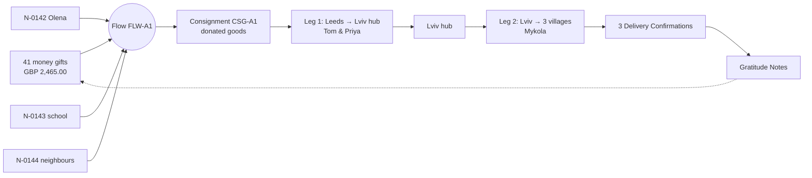

# Scenario A — Transport Fundraiser

**Tier 1 — Spring.** Open River Aid raises **GBP 2,400** for fuel, ferry and road costs to drive one van of donated goods from Leeds to its Lviv hub, where Mykola takes the load on to three villages in Kharkiv oblast. Seed file: `seed/demo/scenario-a.ndjson`. Back to [[Demo Content Overview]].

## Campaign card

| Field | en-GB | uk |
|---|---|---|
| Title | One van to Kharkiv oblast: fuel and ferry | Один бус до Харківщини: пальне та пором |
| Summary | Our volunteers Tom and Priya will drive a van of winter supplies from Leeds to Lviv. From there, Mykola takes them to three villages in Kharkiv oblast. We need GBP 2,400 for fuel, the ferry and road costs. | Наші волонтери Том і Прія повезуть бус із зимовими речами з Лідса до Львова. Звідти Микола доставить їх у три села на Харківщині. Нам потрібно 2 400 фунтів на пальне, пором і дорожні витрати. |
| What's in the van | 2 petrol generators, 40 thermal blankets, 60 hygiene kits, 12 power banks — all donated at our Leeds collection point. | 2 бензинові генератори, 40 термоковдр, 60 гігієнічних наборів, 12 павербанків — усе це подарували люди в нашому пункті збору в Лідсі. |
| Surplus promise | If we raise more than we need, the rest pays for the next run's fuel. We will show you exactly how much. | Якщо ми зберемо більше, ніж потрібно, решта піде на пальне для наступного рейсу. Ми покажемо точну суму. |
| Goal | GBP 2,400.00 | 2 400,00 GBP |
| Dates | 2 February – 6 March 2026 | 2 лютого – 6 березня 2026 року |

## Cast

| Person | Role in scenario | Person id |
|---|---|---|
| Andriy | Lead Coordinator | `per_andriy` |
| Iryna | Director; Contributing Coordinator; approves campaign page | `per_iryna` |
| Helen | Finance Steward | `per_helen` |
| Tom, Priya | Carriers, Leg 1 (Leeds → Lviv, return) | `per_tom`, `per_priya` |
| Mykola | Carrier, Leg 2 (Lviv → Kharkiv oblast) | `per_mykola` |
| James | Giver (GBP 50.00) | `per_james` |
| Sarah / Brightwell Joinery Ltd | Sponsor (GBP 500.00, restricted to ferry) | `per_sarah`, `org_brightwell` |
| Olena | Recipient, need `N-0142` (generator) | `per_olena` |
| Village school | Institutional recipient, need `N-0143` (generator, blankets) via its head teacher | `org_school_k1` |
| "Neighbours of one street" | Need `N-0144` (hygiene kits, power banks) asked by the village head on behalf of 11 households | `per_starosta` |

## Flow at a glance

## Seed event sequence

Times are UTC (Ukraine is UTC+2 in February). Amounts are in original currency; FX to GBP is recorded on the event (`fx`). `vis` = default [[Visibility Levels|visibility]] of the event.

| # | occurredAt | Event type | Aggregate | Actor (role · via) | Payload highlights | vis |
|---|---|---|---|---|---|---|
| 1 | 2026-02-02T09:00Z | `campaign.Drafted` | CMP-A | Andriy · Coordinator · studio | goal GBP 2,400.00; purpose `transport`; surplus rule `next_run_fuel` | team |
| 2 | 2026-02-02T11:30Z | `campaign.Launched` | CMP-A | Iryna · Director · studio | locales en-GB, uk; DP-10 approval id | public |
| 3 | 2026-02-02T12:04Z | `gift.Pledged` | GFT-001 | James · Giver · web | GBP 50.00; channel `stripe_checkout`; name form: first name + city | private |
| 4 | 2026-02-02T12:05Z | `gift.Received` | GFT-001 | system · webhook | GBP 50.00; provider ref `cs_demo_…`; fee GBP 0.95 | private |
| 5 | 2026-02-03T08:40Z | `gift.Pledged` | GFT-002 | Sarah · Sponsor · web | GBP 500.00; restriction `ferry`; public name "Brightwell Joinery" | private |
| 6 | 2026-02-05T10:12Z | `gift.Received` | GFT-002 | Helen · Finance Steward · studio | bank transfer; evidence: statement line (image, team) | private |
| 7 | 2026-02-02 → 02-16 | `gift.Pledged` + `gift.Received` ×39 | GFT-003…041 | various · web / system | amounts GBP 5–200; 6 via Monobank jar in UAH (FX 0.01905) | private |
| 8 | 2026-02-09T14:20Z | `need.Submitted` | N-0142 | Andriy · Coordinator · studio (by phone, on Olena's behalf) | category `generator`; form `goods`; oblast Kharkiv; medical flag (cold storage) | private |
| 9 | 2026-02-09T14:22Z | `consent.Granted` | CNS-0142-1 | Olena · Recipient · phone (recorded by Andriy) | `share.carrier`, `health.process`; wording `@2`, uk | private |
| 10 | 2026-02-09T15:05Z | `need.Submitted` | N-0143 | school head · Recipient (institution) · web | generator + 20 blankets; pupils 34 (count only) | private |
| 11 | 2026-02-10T07:50Z | `need.Submitted` | N-0144 | village head · Recipient (on behalf of) · web | 11 households; hygiene kits, power banks | private |
| 12 | 2026-02-10T09:00Z | `need.Triaged` ×3 | N-0142/43/44 | Andriy · Coordinator · studio | DP-01: priority `winter-critical`; verification `light` (DP-02) | team |
| 13 | 2026-02-16T18:00Z | `campaign.GoalReached` | CMP-A | system | raised GBP 2,465.00 from 41 gifts | public |
| 14 | 2026-02-17T09:10Z | `flow.Formed` | FLW-A1 | Andriy · Coordinator · studio | needs ×3, campaign CMP-A; Lead Andriy, Contributing Iryna | team |
| 15 | 2026-02-17T09:30Z | `consignment.PackingStarted` | CSG-A1 | Tom · Volunteer · web | items: 2 generators, 40 blankets, 60 kits, 12 power banks | team |
| 16 | 2026-02-18T19:00Z | `consignment.Ready` | CSG-A1 | Tom · Volunteer · web | 3.1 m³, 410 kg; humanitarian cargo list attached | team |
| 17 | 2026-02-19T10:00Z | `leg.CarrierAssigned` ×2 | LEG-A1, LEG-A2 | Andriy · Coordinator · studio | DP-05: Leg 1 Tom & Priya; Leg 2 Mykola | team |
| 18 | 2026-02-19T10:05Z | `flow.Committed` | FLW-A1 | Andriy · Coordinator · studio | | participants |
| 19 | 2026-02-20T05:30Z | `consignment.Dispatched` | CSG-A1 | Andriy · Coordinator · studio | DP-07 checklist complete | participants |
| 20 | 2026-02-20T05:32Z | `leg.Departed` | LEG-A1 | Priya · Carrier · web (magic link) | from Leeds collection point | participants |
| 20a | 2026-02-20T05:32Z | `consignment.InTransit` | CSG-A1 | system | on LEG-A1 | participants |
| 21 | 2026-02-20T07:10Z | `costRecord.Submitted` | CR-A01 | Priya · Carrier · web | fuel, UK · GBP 64.20 · receipt photo | team |
| 22 | 2026-02-20T21:15Z | `costRecord.Submitted` | CR-A02 | Tom · Carrier · web | ferry Harwich–Hook of Holland, return, van + 2 + cabin · GBP 486.00 | team |
| 23 | 2026-02-21 → 02-22 | `costRecord.Submitted` | CR-A03 | Priya · Carrier · web | fuel NL/DE/PL outbound · EUR 548.30 (fx 0.8512 → GBP 466.71) | team |
| 24 | 2026-02-22T13:40Z | `costRecord.Submitted` | CR-A04 | Tom · Carrier · web | A4 motorway toll, outbound · PLN 84.00 (fx 0.1985 → GBP 16.67) | team |
| 25 | 2026-02-22T19:25Z | `costRecord.Submitted` | CR-A05 | Tom · Carrier · web | Ukrainian border motor insurance, 15 days · UAH 1,350.00 (fx 0.01905 → GBP 25.72) | team |
| 26 | 2026-02-23T08:45Z | `costRecord.Submitted` | CR-A06 | Priya · Carrier · web | fuel, border → Lviv · UAH 1,120.00 (→ GBP 21.34) | team |
| 27 | 2026-02-23T10:20Z | `leg.HandedOver` | LEG-A1 | Andriy · Coordinator · studio | at Lviv hub; count check 114/114 items; photo (no faces) | participants |
| 28 | 2026-02-23T10:21Z | `consignment.ArrivedAtHub` | HUB-LVIV | Andriy · Coordinator · studio | CSG-A1 rests overnight; next leg LEG-A2 | team |
| 29 | 2026-02-24T04:30Z | `leg.Departed` | LEG-A2 | Mykola · Carrier · web | from Lviv hub | participants |
| 30 | 2026-02-25T11:05Z | `deliveryConfirmation.Recorded` | DC-0142 | Olena · Recipient · SMS link | received generator; photo of generator only; method `recipient` | private |
| 31 | 2026-02-25T12:40Z | `deliveryConfirmation.Recorded` | DC-0143 | school head · Recipient (institution) · web | generator + 20 blankets; method `institution` | private |
| 32 | 2026-02-25T14:10Z | `deliveryConfirmation.Recorded` | DC-0144 | Mykola · Carrier · web | 11 households via village head; method `carrier_with_evidence` (signed list photo, team) | team |
| 33 | 2026-02-25T14:12Z | `consignment.Delivered` | CSG-A1 | system | all items delivered | participants |
| 34 | 2026-02-26T16:30Z | `costRecord.Submitted` | CR-A10 | Mykola · Carrier · web | fuel Lviv ↔ Kharkiv oblast, round trip · UAH 19,460.00 (→ GBP 370.71) | team |
| 35 | 2026-02-26T17:00Z | `leg.Closed` | LEG-A2 | Andriy · Coordinator · studio | | participants |
| 36 | 2026-02-26 → 02-28 | `costRecord.Submitted` ×3 | CR-A07…09 | Tom, Priya · Carrier · web | return: fuel EUR 521.80 (→ GBP 444.16); toll PLN 84.00 (→ GBP 16.67); fuel UK GBP 58.90 | team |
| 37 | 2026-02-28T20:10Z | `leg.Closed` | LEG-A1 | Andriy · Coordinator · studio | van back in Leeds | participants |
| 38 | 2026-03-01T09:00Z | `deliveryConfirmation.Accepted` | DC-0144 | Daria · Coordinator · studio | DP-08: accepted; follow-up call to 2 households done | team |
| 39 | 2026-03-01T10:15Z | `gratitudeNote.Written` | GN-0142 | Olena · Recipient · SMS link | text uk; consent `gratitude.participants`, `gratitude.wall` (first name only) | participants |
| 40 | 2026-03-01T13:00Z | `gratitudeNote.Written` | GN-0143 | school head · web | text uk + en; consent `gratitude.wall` (as "a village school") | participants |
| 41 | 2026-03-02 → 2026-03-03T10:00Z | `costRecord.Approved` ×10 | CR-A01…10 | Helen · Finance Steward · studio | DP-06; none reaches GBP 1,000, so one approver suffices ([[Canonical Parameters]]) | public (aggregated) |
| 42 | 2026-03-03T11:00Z | `gift.RestrictionVaried` | GFT-002 | Helen · studio | GBP 14.00 unspent ferry restriction released to fuel, with sponsor's written agreement | team |
| 43 | 2026-03-03T11:30Z | `flow.Confirmed` | FLW-A1 | Andriy · Coordinator · studio | 3/3 needs confirmed | participants |
| 44 | 2026-03-03T11:31Z | `need.Closed` ×3 | N-0142/43/44 | system | | private |
| 45 | 2026-03-04T09:00Z | `consent.Granted` | CNS-0142-2 | Olena · SMS link | `story.public`: oblast, "grandmother", generator; no photo of her; text approved | private |
| 46 | 2026-03-05T15:00Z | `report.Generated` | RPT-A | system | auto draft from projections | team |
| 47 | 2026-03-06T14:00Z | `publication.Published` | RPT-A | Iryna · Director · studio | DP-10; locales en-GB, uk; more than 72 h after the last ledger entry (03-03T11:00Z), as [[Canonical Parameters]] requires | public |
| 48 | 2026-03-06T14:05Z | `flow.Reported` | FLW-A1 | system | | participants |
| 49 | 2026-03-06T14:10Z | `campaign.SurplusReallocated` | CMP-A → CMP-A2 | Helen · Finance Steward · studio | GBP 452.57 to "Fuel for the next run" per published surplus rule | public |
| 50 | 2026-03-06T14:11Z | `campaign.Closed` | CMP-A | Andriy · studio | | public |
| 51 | 2026-03-06T14:30Z | `gift.Acknowledged` ×41 | GFT-001…041 | system | Donor Reports generated and sent | private |

## Costs

| Ref | Cost | Currency | Amount | FX → GBP | GBP | Leg |
|---|---|---|---|---|---|---|
| CR-A01 | Fuel, Leeds → Harwich | GBP | 64.20 | 1 | 64.20 | 1 |
| CR-A02 | Ferry Harwich – Hook of Holland, return | GBP | 486.00 | 1 | 486.00 | 1 |
| CR-A03 | Fuel NL/DE/PL, outbound | EUR | 548.30 | 0.8512 | 466.71 | 1 |
| CR-A04 | A4 motorway toll, outbound | PLN | 84.00 | 0.1985 | 16.67 | 1 |
| CR-A05 | Border motor insurance (Ukraine) | UAH | 1,350.00 | 0.01905 | 25.72 | 1 |
| CR-A06 | Fuel, border → Lviv | UAH | 1,120.00 | 0.01905 | 21.34 | 1 |
| CR-A07 | Fuel PL/DE/NL, return | EUR | 521.80 | 0.8512 | 444.16 | 1 |
| CR-A08 | A4 motorway toll, return | PLN | 84.00 | 0.1985 | 16.67 | 1 |
| CR-A09 | Fuel, Harwich → Leeds | GBP | 58.90 | 1 | 58.90 | 1 |
| CR-A10 | Fuel, Lviv ↔ Kharkiv oblast | UAH | 19,460.00 | 0.01905 | 370.71 | 2 |
| — | Payment processing fees (41 gifts) | GBP | 41.35 | 1 | 41.35 | — |
| | **Total costs** | | | | **2,012.43** | |

**Golden totals:** raised GBP 2,465.00 · spent GBP 2,012.43 · surplus GBP 452.57 reallocated · 3 needs (12 households + 1 school) confirmed · 2 public gratitude notes.

> [!decision] Decision points exercised
> [[DP-01 Need Triage]] (#12), [[DP-02 Need Verification]] (light, #12), [[DP-05 Routing and Carrier Assignment]] (#17), [[DP-07 Dispatch]] (#19), [[DP-08 Delivery Confirmation Review]] (#38), [[DP-06 Cost Approval]] (#41), [[DP-09 Publication Consent]] (#45), [[DP-10 Report Publication]] (#2, #47).

## Final report text

| en-GB | uk |
|---|---|
| **One van, three villages, 41 givers.** | **Один бус, три села, 41 благодійник.** |
| Between 2 and 16 February, 41 of you gave GBP 2,465 for the journey. Brightwell Joinery covered the ferry. Thank you. | З 2 по 16 лютого 41 людина пожертвувала 2 465 фунтів на цю поїздку. Пором оплатила компанія Brightwell Joinery. Дякуємо! |
| On 20 February Tom and Priya left Leeds before dawn. Three days and 2,300 km later they handed 114 items to Andriy at our Lviv hub. | 20 лютого Том і Прія виїхали з Лідса ще до світанку. Через три дні й 2 300 км вони передали 114 речей Андрію в нашому львівському хабі. |
| On 25 February Mykola delivered everything to three villages in Kharkiv oblast: a generator for a grandmother caring for her grandson, a generator and blankets for a village school, and hygiene kits and power banks for eleven households on one street. | 25 лютого Микола доставив усе до трьох сіл на Харківщині: генератор — бабусі, яка доглядає онука, генератор і ковдри — сільській школі, а гігієнічні набори й павербанки — одинадцяти родинам з однієї вулиці. |
| **What it cost:** GBP 2,012.43 — fuel GBP 1,426.02, ferry GBP 486.00, tolls and border insurance GBP 59.06, payment fees GBP 41.35. Every receipt is in the ledger. | **Скільки це коштувало:** 2 012,43 GBP — пальне 1 426,02 GBP, пором 486,00 GBP, дорожні збори та прикордонне страхування 59,06 GBP, комісії платіжних сервісів 41,35 GBP. Кожен чек — у реєстрі прозорості. |
| **What's left:** GBP 452.57, as promised, now pays for fuel on the next run. | **Залишок:** 452,57 GBP, як ми й обіцяли, піде на пальне для наступного рейсу. |
| *"Now my grandson does his homework with the light on. Thank you to everyone who drove so far."* — Olena, Kharkiv oblast (shared with her permission) | *«Тепер онук робить уроки при світлі. Дякую всім, хто їхав так далеко».* — Олена, Харківщина (поширено з її дозволу) |

In the published report every figure above is a **live data block** bound to the ledger projection (see [[Content Management]]); only the sentences are written by the Editor. The golden file asserts `fuel = 1,426.02`, `ferry = 486.00`, `roads = 59.06`, `fees = 41.35`, `total = 2,012.43`.

## Related
[[Campaign Page]] · [[Transparency Ledger]] · [[Donor Report]] · [[Journey Story]] · [[Transport and Logistics Flow]] · [[Demo Stories and Gratitude]] · [[Demo Articles and Reports]]
