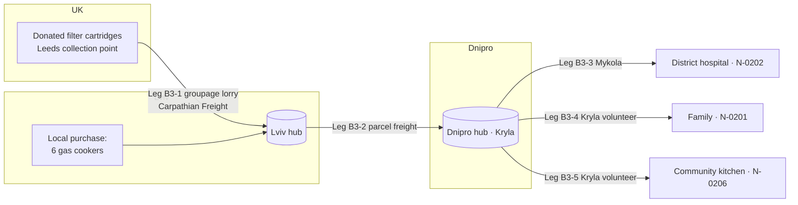

# Scenario B — Regional Aid Hub

**Tier 3 — River.** Three months (May–July 2026) of Open River Aid working across two hubs — **Lviv** (own) and **Dnipro** (run by partner **Kryla Community Foundation / БФ «Крила громади»**) — with several coordinators, multi-leg routes and a hand-off of the Lead Coordinator role mid-flow. Seed file: `seed/demo/scenario-b.ndjson`. Back to [[Demo Content Overview]].

## Setting

| | en-GB | uk |
|---|---|---|
| Campaign | Water and warm meals for Dnipropetrovsk oblast | Вода й гаряча їжа для Дніпропетровщини |
| Campaign summary | Families who recently moved to Dnipro, a district hospital and a community kitchen asked for help with clean water and cooking. We are bringing filter cartridges from the UK and buying cookers and burners in Ukraine, where they are cheaper and support local traders. | Родини, які нещодавно переїхали до Дніпра, районна лікарня та громадська кухня попросили допомогти з чистою водою й приготуванням їжі. Ми веземо картриджі для фільтрів із Великої Британії, а плити й пальники купуємо в Україні — там вони дешевші, і це підтримує місцевих підприємців. |
| Goal | GBP 9,000.00 (goods + transport) | 9 000,00 GBP (речі + доставка) |
| Partner | Kryla Community Foundation runs the Dnipro hub and a community kitchen; its coordinator Serhiy is a Contributing Coordinator on eastern flows. | БФ «Крила громади» керує хабом у Дніпрі та громадською кухнею; його координатор Сергій — співкоординатор східних потоків. |

## People and scopes

| Person | Role | Scope |
|---|---|---|
| Andriy | Lead Coordinator | Lviv hub; FLW-B3 until arrival in Dnipro |
| Oksana | Coordinator → Lead Coordinator | Dnipro hub; FLW-B3 from hand-off |
| Serhiy (Kryla) | Contributing Coordinator ([[Partner Organisation]] staff) | Flows touching the Dnipro hub |
| Daria | Safeguarding Lead; Contributing Coordinator | Organisation |
| Helen | Finance Steward | Organisation |
| Carpathian Freight Sp. z o.o. (fictional) | [[Partner Organisation]] as [[Carrier]] | Leg UK → Lviv (groupage lorry) |
| National parcel freight (generic) | Carrier (courier service) | Leg Lviv → Dnipro |
| Mykola; Kryla volunteer drivers | Carriers | Last-mile legs from Dnipro hub |
| Sarah / Brightwell Joinery | Sponsor | Restricted: transport costs |

## Needs in this scenario

From [[Demo Needs]]: N-0201 (gas cooker, displaced family), N-0202 (district hospital, water filtration), N-0203 (lifts to hospital), N-0204 (school shoes, Lviv), N-0205 (entrance ramp, Lviv), N-0206 (community kitchen burners — money for local purchase).

## Flow FLW-B3: a multi-leg journey



### Coordination and hand-off

```mermaid
sequenceDiagram
    autonumber
    participant A as Andriy (Lead, Lviv)
    participant O as Oksana (Dnipro)
    participant S as Serhiy (Kryla)
    participant H as Helen (Finance)
    A->>A: flow.Formed FLW-B3 (Lead Andriy; Contributing Oksana, Serhiy)
    A->>H: costRecord.Submitted — local purchase of cookers
    H-->>A: costRecord.Approved (DP-06)
    A->>O: flow.LeadHandoverProposed (consignment arriving in Dnipro)
    O-->>A: accepts the hand-off
    Note over A,O: flow.LeadHandedOver — handover note attached (team)
    O->>S: leg.CarrierAssigned B3-4, B3-5 to Kryla volunteers (DP-05)
    S->>O: deliveryConfirmation.Recorded (kitchen, by institution)
    O->>O: flow.Confirmed
```

## Seed event summary (key events)

| # | occurredAt (UTC) | Event type | Aggregate | Actor · via | Payload highlights | vis |
|---|---|---|---|---|---|---|
| 1 | 2026-05-04T08:00Z | `partner.AgreementSigned` | ORG-KRYLA | Iryna · studio | roles: hub operator (Dnipro), co-coordinator; charter accepted | team |
| 2 | 2026-05-04T08:30Z | `hub.Opened` | HUB-DNP | Iryna · studio | operator `org_kryla`; public label "Dnipro" | public |
| 3 | 2026-05-05T10:00Z | `campaign.Launched` | CMP-B | Iryna · studio | goal GBP 9,000.00 | public |
| 4 | 2026-05-06 → 05-20 | `need.Submitted` ×6 | N-0201…0206 | recipients · web; Oksana · studio (phone) | see [[Demo Needs]] | private |
| 5 | 2026-05-07T12:10Z | `offer.Submitted` | OFR-B09 | a church group, UK · web | used children's clothing; condition: "photos of children wearing them for our newsletter" | private |
| 6 | 2026-05-08T09:00Z | `offer.DeclinedWithThanks` | OFR-B09 | Andriy · studio | DP-03: condition conflicts with [[Ethics Charter#3. No proselytising, no political capture]] and §5; kind reply sent, invited to give without conditions | team |
| 7 | 2026-05-09T14:00Z | `offer.Accepted` | OFR-B11 | UK filter manufacturer (fictional "ClearSpring Ltd") · web | 240 filter cartridges | team |
| 8 | 2026-05-12T09:30Z | `need.Referred` | N-0203 | Oksana · studio | lifts to hospital referred to Kryla's volunteer transport service; recipient informed | private |
| 9 | 2026-05-14T11:00Z | `flow.Formed` | FLW-B3 | Andriy · studio | needs N-0201, N-0202, N-0206; Lead Andriy | team |
| 10 | 2026-05-15T16:20Z | `costRecord.Submitted` | CR-B31 | Andriy · studio | 6 gas cookers, Lviv supplier · UAH 52,800.00 (fx 0.01890 → GBP 997.92); two quotes attached | team |
| 11 | 2026-05-16T10:00Z | `costRecord.Approved` | CR-B31 | Helen · studio | DP-06 | public (aggregated) |
| 12 | 2026-05-19T06:00Z | `leg.Departed` | LEG-B3-1 | Carpathian Freight · api | groupage, Leeds → Lviv | participants |
| 13 | 2026-05-23T15:40Z | `leg.HandedOver` | LEG-B3-1 | Andriy · studio | 240/240 cartridges | participants |
| 14 | 2026-05-23T16:00Z | `costRecord.Submitted` | CR-B32 | Carpathian Freight · api | groupage share · EUR 640.00 (fx 0.8490 → GBP 543.36); restricted: sponsor transport | team |
| 15 | 2026-05-26T07:00Z | `leg.Departed` | LEG-B3-2 | Andriy · studio | parcel freight, 14 parcels; tracking refs (team) | participants |
| 16 | 2026-05-27T13:30Z | `leg.HandedOver` | LEG-B3-2 | Oksana · studio | at Dnipro hub; 1 parcel damaged (cookers ok, box replaced) | participants |
| 17 | 2026-05-27T13:45Z | `flow.LeadHandedOver` | FLW-B3 | Andriy → Oksana · studio | hand-off note (team); Andriy stays Contributing | team |
| 18 | 2026-05-28T08:00Z | `leg.CarrierAssigned` ×3 | LEG-B3-3…5 | Oksana · studio | DP-05: Mykola (hospital), Kryla volunteers (family, kitchen) | team |
| 19 | 2026-05-28T12:20Z | `deliveryConfirmation.Recorded` | DC-0202 | hospital deputy director · web | method `institution`; 160 cartridges | private |
| 20 | 2026-05-28T15:05Z | `deliveryConfirmation.Recorded` | DC-0201 | recipient · SMS link | cooker installed by Kryla volunteer | private |
| 21 | 2026-05-29T10:00Z | `deliveryConfirmation.Recorded` | DC-0206 | Serhiy · Partner · studio | kitchen: 80 cartridges + UAH 24,000 local purchase of 2 burners (CR-B36) | team |
| 22 | 2026-06-02T09:00Z | `reputation.ContestRaised` | per_mykola | Mykola · web | "late" timeliness signal on LEG-B3-3 — road closure | private |
| 23 | 2026-06-04T11:00Z | `reputation.SignalCorrected` | per_mykola | Daria · studio | DP-11: excused (external cause); explanation visible to Mykola | private |
| 24 | 2026-06-05T10:00Z | `consent.Granted` | CNS-0202 | hospital (authorised officer) · web | `name.public` for the institution; no patients or staff named | team |
| 25 | 2026-06-05T10:30Z | `visibility.Changed` | N-0202 `recipientName` | Oksana + Daria · studio | DP-12: `private` → `public` (institution name only) | team |
| 26 | 2026-06-06T09:00Z | `flow.Confirmed` | FLW-B3 | Oksana · studio | 3/3 | participants |
| 27 | 2026-06-20T12:00Z | `safeguarding.ConcernRaised` | per_giver_b17 | system rule | giver asked twice for the phone number of family N-0204 | sealed |
| 28 | 2026-06-20T15:00Z | `visibility.Sealed` + `role.Suspended` | per_giver_b17 | Daria · studio | messaging disabled pending review; no reason shown outside `sealed` | sealed |
| 29 | 2026-07-06T09:00Z | `publication.Published` | RPT-B-Q2 | Iryna · studio | quarterly [[Impact Report]] (DP-10); after the 72-hour aggregate delay ([[Canonical Parameters]]) | public |
| 30 | 2026-07-31T17:00Z | `campaign.Closed` | CMP-B | Oksana · studio | | public |

> [!decision] What this scenario proves
> Multiple hubs and legs; a partner as carrier (via API) and as co-coordinator; a Lead hand-off that is logged, not implied ([[Coordination Model]]); a gift declined for ethical reasons with dignity ([[DP-03 Offer Acceptance]]); a need referred rather than rejected; a contested reputation signal resolved ([[DP-11 Reputation Review]]); an institution consenting to be named ([[DP-12 Visibility Change]]); a safeguarding red flag handled under `sealed` visibility ([[Safeguarding]]).

## Golden totals

Campaign CMP-B as at 30 June 2026 (the Q2 [[Impact Report]] cut-off).

| Measure | Value |
|---|---|
| Raised | GBP 9,318.40 from 212 gifts (incl. GBP 1,500.00 restricted transport from Brightwell Joinery) |
| Goods offers accepted / declined with thanks | 9 / 2 |
| Needs: confirmed / referred / open | 4 / 1 / 1 (N-0205 ramp — volunteers scheduled for August) |
| Flows | 4 (FLW-B1…B4) |
| Legs | 11, of which 3 by partner organisations |
| Costs | GBP 5,902.15 (goods bought locally GBP 3,210.60 · transport GBP 2,487.10 · fees GBP 204.45) |
| Gratitude notes | 7 (3 public on the [[Gratitude Wall]]) |

## Campaign update copy (posted 29 May 2026)

| en-GB | uk |
|---|---|
| **Clean water has reached the district hospital.** 160 filter cartridges travelled from Leeds to Lviv by lorry, on to Dnipro by parcel freight, and the last 90 km with Mykola. The hospital's deputy director confirmed delivery on 28 May. The other 80 went to the community kitchen run by our partners at Kryla, which now cooks around 300 hot meals a day. | **Чиста вода дійшла до районної лікарні.** 160 картриджів для фільтрів проїхали вантажівкою з Лідса до Львова, далі посилками до Дніпра, а останні 90 км — з Миколою. Заступниця директора лікарні підтвердила отримання 28 травня. Ще 80 картриджів отримала громадська кухня наших партнерів із «Крил громади», яка тепер готує близько 300 гарячих обідів на день. |

## Related
[[Scenario A — Transport Fundraiser]] · [[Scenario C — Humanitarian Programme]] · [[Hub]] · [[Leg]] · [[Coordinator]] · [[Flow Map]] · [[Demo Stories and Gratitude]]
