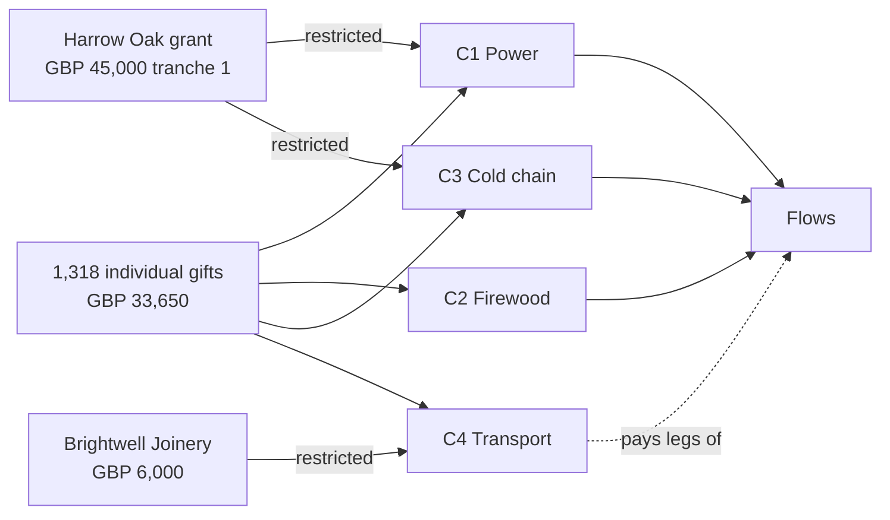

# Scenario C — Humanitarian Programme

**Tier 4 — Basin.** A winter energy programme run by Open River Aid with its partner Kryla Community Foundation as a second tenant organisation, funded by a charitable trust grant, a corporate sponsor and hundreds of individual givers, with grant reporting, auditor access and AI-assisted translation. Seed file: `seed/demo/scenario-c.ndjson`; demo clock "as of" **31 January 2027**. Back to [[Demo Content Overview]].

## Programme card

| Field | en-GB | uk |
|---|---|---|
| Name | Warm Winter 2026–27 | Тепла зима 2026–2027 |
| Purpose | Keep homes, schools and warm spaces in Kharkiv and Dnipropetrovsk oblasts heated and powered through the winter, and keep medicines cold when the power goes out. | Допомогти оселям, школам і пунктам обігріву на Харківщині та Дніпропетровщині мати тепло й світло взимку, а ліки — зберігатися в холоді, коли зникає електрика. |
| Period | 1 October 2026 – 31 March 2027 | 1 жовтня 2026 – 31 березня 2027 року |
| Budget | GBP 120,000.00 | 120 000,00 GBP |
| Organisations | Open River Aid (lead, `demo-ora`), Kryla Community Foundation (`demo-kryla`, partner tenant) | «Відкрита ріка» (провідна організація), БФ «Крила громади» (партнер) |

## Campaigns

| Code | en-GB | uk | Goal (GBP) | Raised | Spent | Delivered (as of 31 Jan 2027) |
|---|---|---|---|---|---|---|
| C1 | Power for schools and warm spaces | Світло для шкіл і пунктів обігріву | 45,000.00 | 38,200.00 | 29,640.00 | 14 portable power stations + 6 solar kits to 9 institutions |
| C2 | Firewood and briquettes | Дрова та паливні брикети | 30,000.00 | 21,450.00 | 17,905.40 | 426 m³ to 142 households (bought locally) |
| C3 | Cold chain for medicines | Холод для ліків | 25,000.00 | 18,500.00 | 9,885.00 | cooling cases and power banks for 65 people |
| C4 | Transport fund | Фонд доставки | 20,000.00 | 6,500.00 | 3,800.00 | 17 legs |
| | **Programme** | **Програма** | **120,000.00** | **84,650.00** | **61,230.40** | |

## Funders

| Funder | Type | Amount | Restriction | Reporting |
|---|---|---|---|---|
| Harrow Oak Foundation (fictional trust) | Grant, 2 tranches | GBP 60,000.00 (tranche 1: 45,000.00 received 2026-10-05; tranche 2: 15,000.00 due after interim report) | C1 GBP 30,000.00; C3 GBP 15,000.00 (tranche 1) | Interim report 15 January 2027; final report 30 April 2027 |
| Brightwell Joinery Ltd (sponsor lead Sarah) | Corporate sponsorship | GBP 6,000.00 | C4 transport only | Quarterly [[Donor Report]]; public mention with logo (consented) |
| Individual givers | 1,318 gifts | GBP 33,650.00 (C1 8,200 · C2 21,450 · C3 3,500 · C4 500) | Unrestricted within campaign | Personal Donor Reports |

Restricted funds are tracked as separate balances; every [[Cost Record]] declares the fund it draws on, and the Finance Steward cannot approve a cost against a restriction it does not match ([[DP-06 Cost Approval]]).

## Needs in this scenario

From [[Demo Needs]]: N-0207 (warm space, solar station), N-0208 (insulin cooling, older woman), N-0209 (firewood, six households, on behalf), N-0210 (property documents — referred), N-0211 (washing machine — withdrawn), N-0212 (hospital generator fuel — money for local purchase).

## Seed event summary (key events)

| # | occurredAt (UTC) | Event type | Aggregate | Actor · via | Payload highlights | vis |
|---|---|---|---|---|---|---|
| 1 | 2026-09-28T09:00Z | `programme.Planned` | PRG-WW26 | Iryna · studio | budget GBP 120,000.00; orgs `demo-ora`, `demo-kryla` | team |
| 2 | 2026-10-01T08:00Z | `campaign.Launched` ×4 | C1…C4 | Kateryna (Editor) · studio | en-GB + uk; uk copy human-written, en-GB AI-assisted and reviewed | public |
| 3 | 2026-10-05T10:00Z | `gift.Received` | GFT-HO-1 | Helen · studio | GBP 45,000.00; restricted split C1 30,000 / C3 15,000; grant agreement ref | team |
| 4 | 2026-10-06T11:00Z | `gift.Received` | GFT-BW-1 | Helen · studio | GBP 6,000.00; restricted C4 | team |
| 5 | 2026-10-14T07:30Z | `need.Submitted` | N-0207 | warm-space manager · web (uk) | solar station; institution | private |
| 6 | 2026-10-14T07:31Z | `ai.SuggestionMade` | N-0207 | system · **vertex** | 3-line summary for coordinator queue; advisory | team |
| 7 | 2026-10-14T09:05Z | `ai.SuggestionAccepted` | N-0207 | Oksana · studio | accepted with one edit | team |
| 8 | 2026-10-20T10:00Z | `flow.MatchSuggested` | N-0207 ↔ GFT-HO-1 | system · **vertex** | advisory: C1 restricted fund fits; confidence note | team |
| 9 | 2026-10-20T10:40Z | `flow.Formed` | FLW-C12 | Oksana · studio | DP-04: human decision; suggestion id referenced | team |
| 10 | 2026-11-03 → 2027-01-20 | `costRecord.Approved` ×148 | CR-C… | Helen; Oksana (≤ GBP 250) · studio | per-fund; 31 in UAH, 9 in EUR, 4 in PLN | public (aggregated) |
| 11 | 2026-11-18T13:00Z | `need.Referred` | N-0210 | Oksana · studio | to a free legal aid partner; consent `share.partner` | private |
| 12 | 2026-11-25T09:00Z | `need.Withdrawn` | N-0211 | recipient · SMS link | "we moved to relatives"; kind acknowledgement sent | private |
| 13 | 2026-12-10T12:00Z | `gratitudeNote.Written` | GN-0207 | warm-space manager · web (uk) | consent `gratitude.wall` | participants |
| 14 | 2026-12-10T12:01Z | `translation.MachineDrafted` | GN-0207 → en-GB | system · **vertex** | model id, prompt template version; PII-scrubbed input | team |
| 15 | 2026-12-10T16:20Z | `translation.Approved` | GN-0207 → en-GB | Kateryna · studio | 3 edits (see below), then approved | team |
| 16 | 2026-12-10T16:21Z | `gratitudeNote.Translated` | GN-0207 → en-GB | Kateryna · studio | label "Translated with AI assistance, checked by our team" | participants |
| 17 | 2027-01-08T09:00Z | `role.Granted` | ORG-ORA | Iryna · studio | Pennine Independent Examiners; read-only; expires 2027-02-28 | team |
| 18 | 2027-01-12T10:00Z | `report.Generated` | RPT-HO-INT | system · **vertex** | grant interim report draft from projections; numbers are live blocks | team |
| 19 | 2027-01-15T09:00Z | `publication.Published` | RPT-HO-INT | Iryna · studio | DP-10; audience: funder (private link), summary public | private |
| 20 | 2027-01-31T23:59Z | `programme.SnapshotTaken` | PRG-WW26 | system | golden totals below | team |

## AI-assisted translation — worked example

Every AI draft is a [[Translation]] in state `draft`, visible only to `team`, until a human reviewer approves it ([[Ethics Charter#6. AI ethics]], [[Vertex AI Integration]]).

| Source (uk, written by the warm-space manager) | AI draft (en-GB) | Reviewed (en-GB, published) |
|---|---|---|
| Дякуємо всім, хто подарував нам сонячну станцію! Тепер у нашому пункті обігріву є світло навіть під час відключень. Діти роблять уроки, бабусі заряджають телефони й п'ють гарячий чай. Ви навіть не уявляєте, як це важливо. | Thank you to everyone who gifted us the solar station! Now our heating point has light even during shutdowns. Children do lessons, grandmothers charge phones and drink hot tea. You cannot even imagine how important this is. | Thank you to everyone who gave us the solar power station! Our warm space now has light even during power cuts. Children do their homework, grandmothers charge their phones and have a hot cup of tea. You can't imagine how much this means to us. |

Reviewer's edits: "heating point" → "warm space" (glossary term), "shutdowns" → "power cuts" (en-GB idiom), "do lessons" → "do their homework"; tone softened in the last sentence. Edits feed the organisation glossary used in later prompts ([[Internationalisation]]).

## Grant report excerpt (interim, Harrow Oak Foundation)

| en-GB | uk |
|---|---|
| **Interim report, 1 October 2026 – 31 December 2026.** Your grant of GBP 45,000.00 (first tranche) is restricted to power for schools and warm spaces (GBP 30,000.00) and cold chain for medicines (GBP 15,000.00). | **Проміжний звіт, 1 жовтня – 31 грудня 2026 року.** Ваш грант у розмірі 45 000,00 GBP (перший транш) призначений на світло для шкіл і пунктів обігріву (30 000,00 GBP) та холод для ліків (15 000,00 GBP). |
| By 31 December we had spent GBP 24,410.00 of the power allocation on 12 power stations and 5 solar kits for 8 institutions, and GBP 7,120.00 of the cold-chain allocation on cooling cases and power banks for 47 people. | Станом на 31 грудня ми витратили 24 410,00 GBP з коштів на світло — на 12 зарядних станцій і 5 сонячних комплектів для 8 закладів, а також 7 120,00 GBP з коштів на холод для ліків — на термокейси й павербанки для 47 людей. |
| All 8 institutions have confirmed delivery; 41 of 47 individual deliveries were confirmed by the recipient and 6 by a relative or neighbour, reviewed by a coordinator. | Усі 8 закладів підтвердили отримання; 41 із 47 особистих доставок підтвердили самі отримувачі, а 6 — родичі чи сусіди, і ці підтвердження перевірив координатор. |
| Unspent restricted balance: GBP 13,470.00, committed to 3 open flows. We request the second tranche on the basis of this report. | Залишок цільових коштів: 13 470,00 GBP, уже закріплених за 3 відкритими потоками. На підставі цього звіту просимо перерахувати другий транш. |

Arithmetic: 45,000.00 − 24,410.00 − 7,120.00 = 13,470.00. Figures in the published version are live data blocks from the restricted-fund projection.

## Golden totals (as of 31 January 2027)

| Measure | Value |
|---|---|
| Raised / spent | GBP 84,650.00 / GBP 61,230.40 |
| Institutions supported | 9 (schools, warm spaces and one district hospital) |
| Households | 142 (firewood) + 65 people (cold chain) |
| Legs / cost records | 17 / 148 |
| AI actions | 212 summaries, 96 translation drafts, 4 report drafts — all human-reviewed; 0 auto-published |
| Translations with reviewer edits | 71 of 96 (74%) |

## Related
[[Programme]] · [[Campaign]] · [[Sponsor]] · [[Report]] · [[Impact Report]] · [[Accountability and Audit]] · [[Scaling Architecture]] · [[Demo Articles and Reports]]
