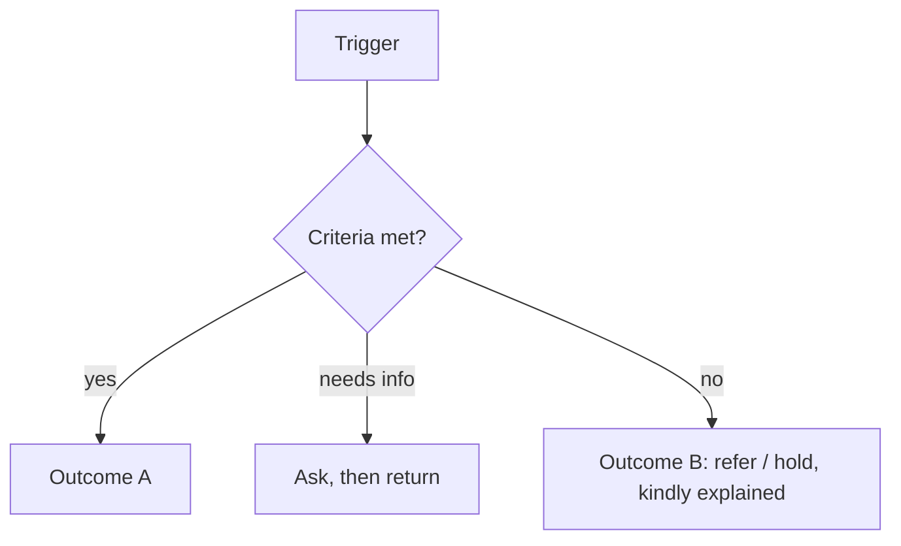

# {{title}}

> [!info] Using this template
> Name the note `DP-NN Title` ([[Conventions#Naming]]); DP ids are fixed — check [[Decision Points Overview]] before adding one, and add it to [[Vault Map]]. Delete this callout when done.

*The question this decision answers, in one line.* Back to [[Decision Points Overview]].

| Field | Value |
|---|---|
| ID | DP-NN |
| Aggregate(s) | [[Need]] / [[Offer]] / [[Flow]] … |
| Trigger event(s) | `aggregate.PastTense` |
| Decider (accountable) | Role from [[Role]] — see [[Responsibility Matrix]] |
| Consulted / informed | … |
| Target time | e.g. within 3 days of trigger |
| Tier | from [[Scaling Tiers]] |

## Question decided

What exactly is being decided, and what is explicitly **not** decided here (e.g. access to asking for help is never decided — [[ADR-005 Open Access for Recipients]]).

## Inputs

| Input | Source (projection / event) | Visibility needed |
|---|---|---|
| … | … | `team` |

## Outcomes

| Outcome | Resulting state | Event | Message to the person (en-GB / uk) |
|---|---|---|---|
| … | … | `…` | … / … |

## Criteria

- Proportionate, explainable criteria; never worthiness or reputation as a gate for recipients ([[Guiding Principles#P3. The left bank is always open]]).

## Flow

## AI assistance

What [[Vertex AI Integration]] may suggest (advisory only), what it must never do, and how the suggestion is logged (`actor.via: vertex`).

## Audit and accountability

Events recorded, reason fields required, four-eyes rules, and how the decision is reviewed ([[Accountability and Audit]]). Disputes: [[Escalation and Disputes]].

## Privacy

> [!privacy] …
> Which fields the decider sees; which stay hidden ([[Visibility Levels]]).

## Anti-patterns

- …

## Related
[[Decision Points Overview]] · [[Responsibility Matrix]] · …
