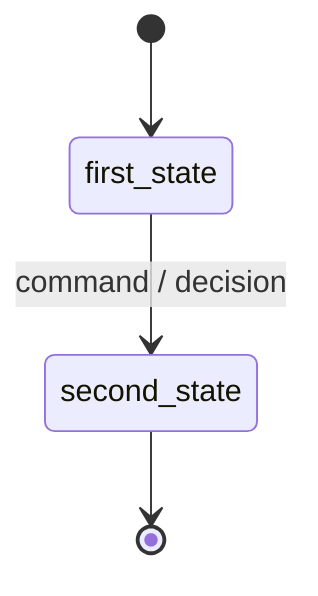

# {{title}}

> [!info] Using this template
> Replace `FAMILY` with `people`, `flow`, `trust`, `content` or `system`, fill every section, then delete this callout. Keep the filename the singular business noun in Title Case and add it to [[Vault Map]] in the same change ([[Conventions#Naming]]). Dataview queries exclude the `99-templates` folder.

*One sentence in plain language: what this is, in the client's words.* Back to [[Entities Index]].

| River alias | Ukrainian (uk) | Family | Introduced at tier |
|---|---|---|---|
| … | … (source of truth: [[Glossary]]) | … | [[Scaling Tiers#Tier 1 — Spring]] … |

## Purpose

- Why the entity exists; which business outcome in [[Business Overview]] it serves.
- What it is **not** (common confusions with neighbouring entities).

## Attributes

Every field carries its own default level from [[Visibility Levels]]. Personal data lives only on [[Person]]; reference it by `personId` ([[Data Minimisation]]).

| Field | Type | Required | Default visibility | Notes / justification |
|---|---|---|---|---|
| `id` | ULID | yes | `team` | |
| `orgId` | string | yes | `team` | Tenant |
| `status` | enum | yes | `team` | See lifecycle |
| … | … | … | `private` | … |

## Lifecycle

| Transition | Command | Decision point | Event |
|---|---|---|---|
| first_state → second_state | `…` | [[DP-01 Need Triage]] … | `aggregate.PastTense` |

## Relationships

| Related entity | Cardinality | Meaning |
|---|---|---|
| [[Flow]] … | 1..* | … |

See [[Entity Relationship Map]].

## Events

Catalogued in [[Event Catalogue]] using [[Template — Event Type]].

| Event | When | Default visibility |
|---|---|---|
| `aggregate.Created` | … | `team` |

## Decision points

> [!decision] Which decisions touch this entity
> `[[DP-NN Title]]` — who decides, see [[Responsibility Matrix]].

## Privacy and visibility

> [!privacy] Private by default
> Which fields are `private` or `sealed`; what each projection shows; retention per [[Data Retention]]; consent purposes per [[Consent Management]].

## Principles

> [!principle] Guiding principles that shape this entity
> [[Guiding Principles#P4. Private by default]] …

## Projections and publications

Which [[Projection]]s read this entity and which publications show it ([[Publications Overview]]).

## Tier notes

| Tier | Behaviour |
|---|---|
| 1 | … |
| 4 | … |

## Open questions

> [!question] …
> Add `#open-question` to the tags and list it in [[Open Questions]].

## Related
[[Entities Index]] · [[Glossary]] · …
