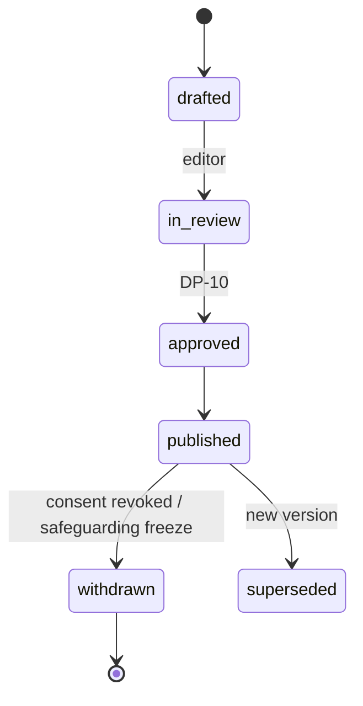

# {{title}}

> [!info] Using this template
> One publication type per note; add it to [[Vault Map]] and to the table in [[Publications Overview]]. Delete this callout when done.

*What this publication tells, and to whom, in one sentence.* Back to [[Publications Overview]].

| Field | Value |
|---|---|
| Audience | … |
| Default visibility | `participants` / `public` / `private` ([[Visibility Levels]]) |
| Source projections | `…` |
| Source events | `…` ([[Event Catalogue]]) |
| Consent needed | purposes from [[Consent Management]] |
| Trigger | automatic / on-demand / scheduled |
| Editor involvement | [[DP-10 Report Publication]] … |
| Locales | en-GB, uk ([[Internationalisation]]) |
| Tier | [[Scaling Tiers]] … |

> [!principle] Honest numbers
> Every figure is a live data block from a projection, with a "How is this counted?" link to [[Impact Metrics]].

## Structure

| Block | Kind | Source | Visibility |
|---|---|---|---|
| Headline | text (editor) | — | as publication |
| Key figures | live data block | `…` | `public` aggregate |
| Journey timeline | live data block | `flowTimeline` | `participants` |
| Story | text (editor, optional AI draft) | — | consent-bound |
| Gratitude strip | live data block | `gratitudeNotes` | consent-bound |

## Redaction

What is removed or pseudonymised for each audience; small-number suppression (k ≥ 5); delays for conflict zones ([[Visibility Levels#Redaction rules per projection]]).

## Lifecycle

## Example (en-GB / uk)

| en-GB | uk |
|---|---|
| … | … |

## Design notes

Layout, motion and accessibility per [[Design Language]] and [[Accessibility]]; tone per [[Brand and Tone of Voice]].

## Related
[[Publications Overview]] · [[Publication Pipeline]] · [[Publication]] · …
